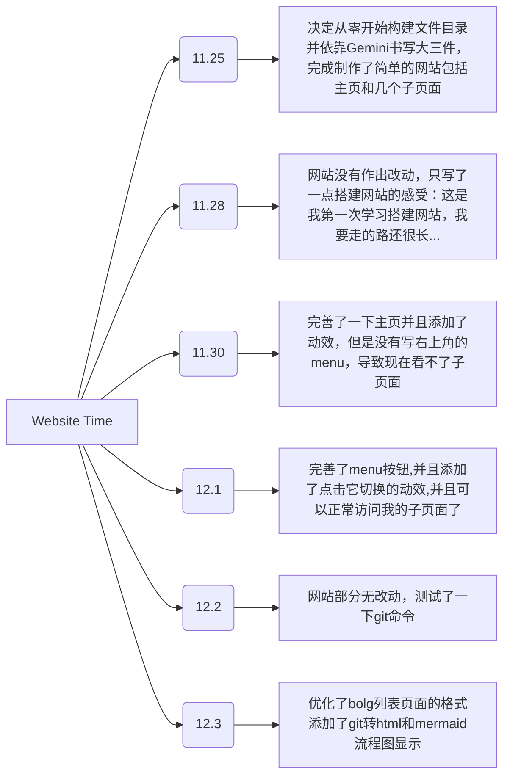

_首先，我想先记录一下先前的网站搭建的时间节点。因为我想规范一下 blog 列表，就把之前那几个看起来不像是博客的东西删掉了。_

---

## 12 月 2 日小记

今天天气有点阴沉，感觉不是适合出去的日子，所以我没有出去。

下午校园跑跑完后我就按照 m1ng 学长的教程，在我的 winch wsl 里安装了 Neovim 配置和 tmux，不过因为我把配置当成了本体，导致我用复制路径的命令的时候一直显示路径找不到，最后是装 neovim 的时候才发现。

七点左右，m1ng 学长给我演示了 neovim 的操作和用处，neovim 的键盘操作和 vim 类似，其中 F 搜索加上大小写 n 选中字词和按列框选的功能令我印象深刻。话说，之前装双系统进入 ttl 编辑禁用 Ubuntu 自带的显卡驱动时，也是 wq 退出，我现在才知道原来是保存并退出啊（write quit）。vim 原来不知不觉已经出现在我的生活里了。 希望后面我能够在 neovim 上来编辑我的 blog。

然后是 tmux，我一开始还奇怪怎么进去了之后啥反应都没有，经过 m1ng 学长的讲解后才知道原来是用来分割窗口的。输入 win/command/superjsuper + |(竖向分割)或者 win/command/supersuper + -(横向分割)。不过这是 m1ng 学长的 config，把 Ctrl+B 定义成了 Ctrl+T ，把 Ctrl+T 定义成了 win/commandcommand/super 键。顺便，我还了解到了原来可以在命令行中直接调用 ai，还有 alt+Tab 快速切窗口摸鱼。

到了 11 点半，我听着电台的音乐，和室友去宁诺吃夜宵。说实话我不知道吃什么，平常点外卖也是，感觉都差不多。不过，晚上出来散散步，聊聊天却是极好的。站在桥上，吹着冷风，吃着豆腐花和鸡排，手上拿着只剩奥尔良鸡腿的骨头的袋子。我不禁思考着，或许一年后，两年后，大学毕业后的我们，会不会记得这个出来吃夜宵的晚上。好像这个疑问，我在高中，初中，小学不知发问过多少遍了，不过之前的都忘记了。可是这一次，相信一定不会忘记，因为我写了 blog。blog 对于我这种健忘的人来说真是个好东西啊。而且我又萌生了一个新的想法，我们寝室四个人一定要在寝室里一起吃个火锅，喝个酒，打个牌，然后在用视频录下来。或许，这是个不错的想法吧。明天，又是新的一天，估计又是九点多才醒。

需要做的事还有很多...不过，这不是坏事。
